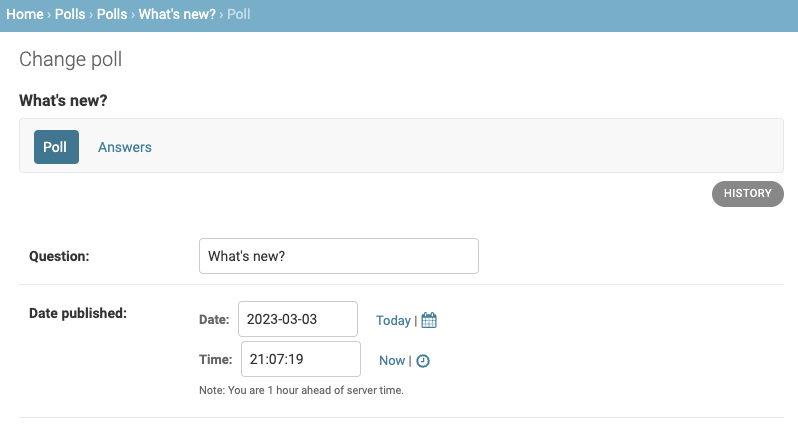
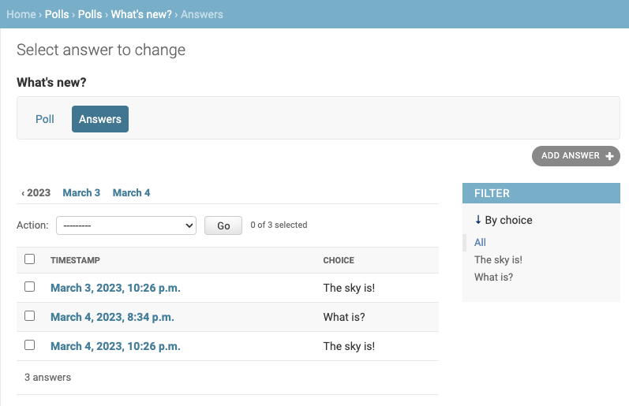

# Django Admin Tabs

[](https://github.com/mehmetakyuz/django-admin-tabs/actions/workflows/ci.yml)

Powerful tabbed admins and nested changelists using plain django admin classes. No javascript.

## Quick-Start Guide

### Installation

```shell
$ pip install django-admin-tabs  # if using pip
$ poetry add django-admin-tabs  # if using poetry
```

Add `django_admin_tabs` to your `INSTALLED_APPS`. The app comes with templates and css staticfiles.


### Usage example

```python
from django.contrib import admin
from django_admin_tabs import (
    AdminChangeListTab,
    AdminTab,
    TabbedModelAdmin,
)
from example.polls.models import Answer, Choice, Poll

class ChoiceInline(admin.StackedInline):
    model = Choice
    extra = 0


class PollAdminStep(AdminTab, admin.ModelAdmin):
    admin_tab_name = "Poll"
    fields = ("question",)
    inlines = (ChoiceInline,)


@admin.register(Answer)
class AnswerAdmin(AdminChangeListTab, admin.ModelAdmin):
    admin_tab_name = "Answers"
    model = Answer
    fk_field = "choice__poll"
    parent_model = Poll
    date_hierarchy = "timestamp"
    list_display = (
        "timestamp",
        "choice",
    )
    list_filter = ("choice",)

    def get_form(self, request, obj=None, **kwargs):
        # Use self.parent_object to access the main admin instance
        form = super().get_form(request, obj, **kwargs)
        form.base_fields['choice'].queryset = self.parent_object.choice_set.all()
        return form


@admin.register(Poll)
class PollAdmin(TabbedModelAdmin, admin.ModelAdmin):
    admin_tabs = [
        PollAdminStep,
        AnswerAdmin,
    ]

```

## AdminTab


This is just a plain Admin class but capable of being split into seperate tabs.
Each tab is a different url, and therefor is loaded and saves independantly of other tabs.

## AdminChangeListTab


Works like a regular django change list, except that it is nested under
an existing parent model's admin, and therefor is filtered for only related objects.

```python
admin_tab_name = "Answers"  # name of the tab
model = Answer  # model of the changelist queryset
parent_model = Poll  # model of the parent object the nested model relates to
fk_field = "choice__poll"  # related path to filter for objects
```


## Limitations

1.  Delete button does not work for nested changelists,
    therefor its hidden. Delete still works with the changelist action.


## Python and Django compatibility

- Python >= 3.8
- Django >= 3.2


## Compatibility with other admin libraries

- https://pypi.org/project/django-object-actions is supported

## Development

```shell
git clone git@github.com:mehmetakyuz/django-admin-tabs.git
cd django-admin-tabs

make dev  # run the development example
make test  # run test suite
```
